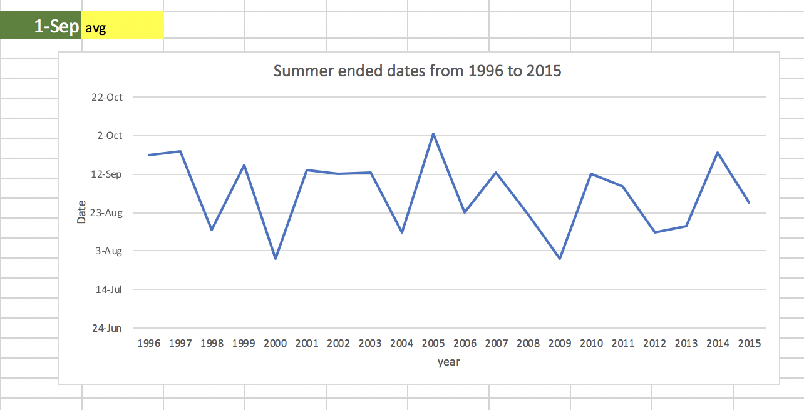
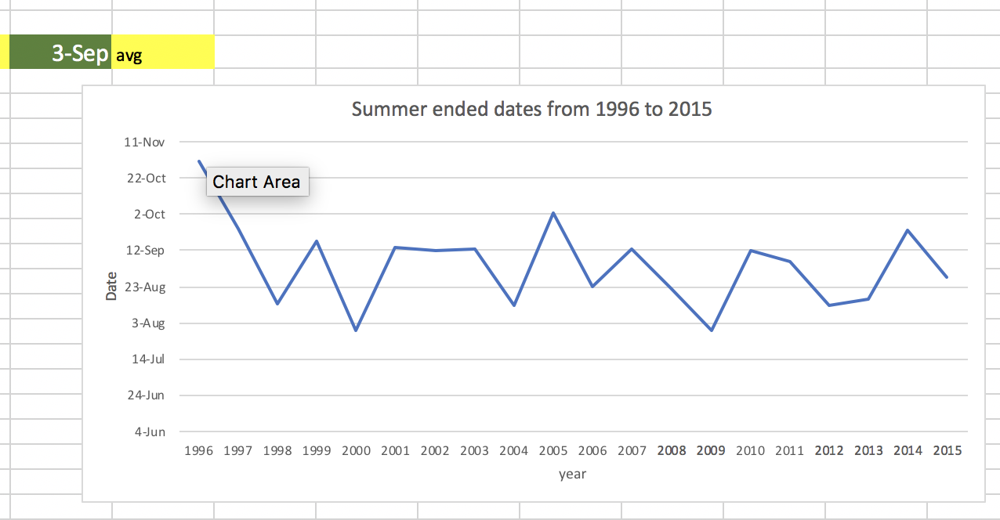
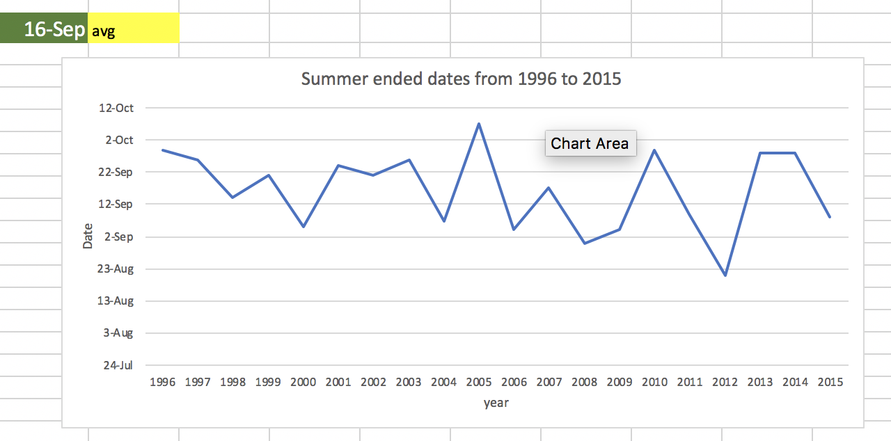
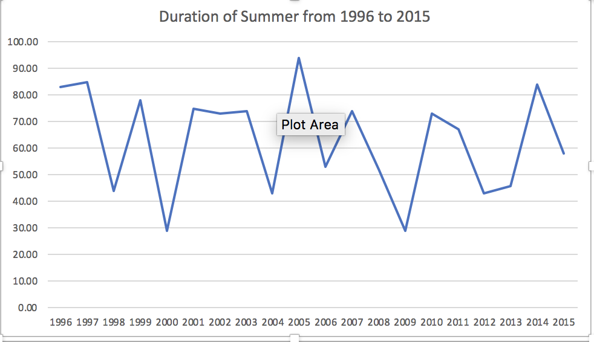
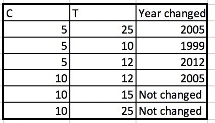

```{r setup, include=FALSE}
knitr::opts_chunk$set(echo = TRUE)
```


# Question 5.1

Use crime.data to test whether there are any outlier in the last column. Use the `grubbs.test` in the outliers package in R.

```{r}
library(outliers)
set.seed(42) #set the seed
#import the data
uscrime <- read.delim("~/Documents/R/GeorgiaTech/DataPreparation/uscrime.txt")
crime <- scale(uscrime$Crime)
# before using the grubbs function it is a good idea to plot the points
plot(crime)
# it is a simple plot, but I can observe that there are two points that are higher than most points
# I cannot see that there are some minium points that could be outliers. so let's test other plotting methods

# with this whiskers plot, I can confirm that there are 2 definite outliers and one other possibe outlier.
boxplot(uscrime$Crime,col=rgb(0,0,1,0.5), main="Box plot of Crime")
# This graph shows that most of the data behaves normal and shows 5 possible outliers.
qqline(uscrime$Crime,col=rgb(0,0,1,0.5))
# now we can apply the grubbs test
outliers <- grubbs.test(uscrime$Crime, type = 10) # test for 1 possible outlier.
print (outliers)
# test the other side
outliers <- grubbs.test(uscrime$Crime, type = 10, opposite=TRUE) # test for 1 possible outlier.
# p-value = 1, no outlier.
print (outliers)

# highest value 1993 is an outlier
# remove first outlier
data <- uscrime$Crime[-match(c(1993), uscrime$Crime)]

# test again
outliers <- grubbs.test(data, type = 10)
print (outliers)
# p-value is not high enough, highest value 1969 is an outlier
data <- data[-match(c(1969), data)]
# test again, p-value here is high enough
outliers <- grubbs.test(data, type = 10)
print (outliers)
boxplot(data,col=rgb(0,0,1,0.5), main="Box plot of Crime")


```

## Analysis

First I made some plots to see how the data was behaving. I saw at least three possible outliers in the highest parts of the data. After removing 2 of them, I plotted the whiskers box and saw that it showed one possible outlier. Since the data is only 47 points, it is probably that the graph and the grubbs test will always say that there is an outlier. So I just removed two of them according to the `p-values`. Also before applying grubbs test I saw if the data had some nomal behavior through the qqplot. 

I didn't used a normality test because I didn't found one that was relaible. Normality tests don't do what most think they do. Shapiro's test, Anderson Darling, and others are null hypothesis tests AGAINST the the assumption of normality. These should not be used to determine whether to use normal theory statistical procedures. In fact they are of virtually no value to the data analyst. Under what conditions are we interested in rejecting the null hypothesis that the data are normally distributed?


# Question 6.1

Sea level decrease/increase is relevant to measure global warming and relevant to measure possible natural disasters as high tides or tsunamis (when the water is pulled). CUSUM can be used to measure and monitor when abrupt changes occur in the sea level in certain threshold, possibly showing evidence of a natural disaster is coming up. Sea level varies naturally, so in this case the threshold should be high enough to only detect abrupt changes in the sea level, a choice could be T = 10 (standard deviations) and C = half standard deviation. This is just an aproximation, but in real world examples there is more information to approximate better this parameters.

# Question 6.2

1. identify when unofficial summer ends (cool off)
2. judgment of whether Atlanta’s summer climate has gotten
warmer in that time (and if so, when).

Use the average for each day and do CUSUM on that
Do CUSUM for each year, then find average change detection date.

## Analysis 6.2.1

First the equation to detect decrease is the following


${x_t}$ = is the observed value at time t.

$\mu$ = the expected value of the observations x.

${x_t}$ - $\mu$ = how much above/below expected the observation is at time t.

${S_t}$ = max{0, ${S_t}$+($\mu$-${x_t}$-C)} (for decrease)

The change is detected when ${S_t}$>=T. C and T are model paramters.

First I calculated the $\mu$ from July to mid August because we know for sure that summer doesn't end in before mid August. (mu should be the average when you are sure no change had occured). Then applied CUSUM to each day in each year, making a matrix in the spreadsheet. Then I made a function to find the index when the ${T}$ value was reached, I mean when the algorithm detected a decrease according to the parameters.

I tested multiple parameters to find out that the average date is very sensible to the ${T}$ value used as the paramter model. The ${C}$ value was not very senitive, and by sensitive I mean that a small change in these parameters could make a big change in the average date when summer ended. With a high threshold of ${T}$ the we detect changes slower but is less likely to falsely detect changes. In this example, that is our goal because it is more important to have a more accurate date. For the critical value I left the default option of 5.

For example I tested C = 5 and T = 50 and the result was that summer ends on 1 Sept (Figure 1). When I tested C = 100 and T = 50, the date only moved 2 days (Figure 2) and when I tested C = 5 and T = 100, the date moved 16 days, so the CUSUM is more sensitive to the T parameter and there is no single right result.







The final result is that unofficial summer ends around 1-Sep according to the data we have from 1996 to 2015.


## Analysis 6.2.2

For this problem we want to solve the question if summer is longer than before

So basically we have to detect a change but now it will be what year summer lasted longer, not in a day/month.

The same equation is used to apply CUSUM but now it will be according the duration of summer each year.

In figure 4 it is shown the  duration of summer across the years, as the graph shows there seems not to be a pattern, it changes a lot from year to year. There must be other factors that affect the duration of the summer each year.




In Figure 5, a made a small table showing how the paramters could change the year that summer changed significantly. The hypothesis that summer climate has gotten
warmer in that time cannot be confirmed or denied with my results. The result is too sensitive but `2005` seems to be the year when summer lasted longer but then in `2009` was the year that lasted the least days.


